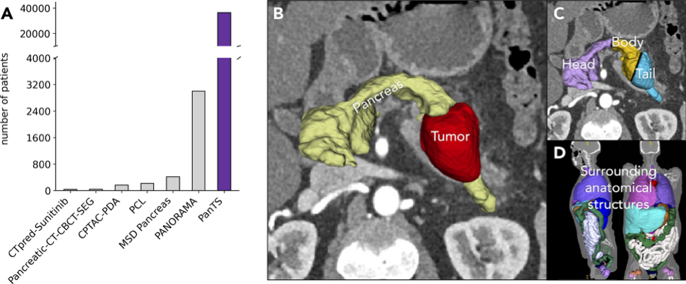

<div align="center">
  
</div>

<h1 align="center" style="font-size: 60px; margin-bottom: 4px">PanTS: The Pancreatic Tumor Segmentation Dataset</h1>

<div align="center">


[](https://github.com/MrGiovanni/PanTS?tab=readme-ov-file#pants-dataset-paired-image-mask-report)
[](https://github.com/MrGiovanni/PanTS?tab=readme-ov-file#pants-benchmark-official-in-distribution-test-set)
[](https://github.com/MrGiovanni/PanTS?tab=readme-ov-file#pants-model) <br/>

[](https://github.com/MrGiovanni/PanTS/stargazers) 
<a href="https://twitter.com/bodymaps317">
        
</a><br/>  

</div>


We present **PanTS** (The Pancreatic Tumor Segmentation Dataset) recently created by JHU. It is a large-scale, multi-institutional dataset, containing **36,390** three-dimensional CT volumes from **145** medical centers, with expert-validated, voxel-wise annotations of over **993,000** anatomical structures, covering pancreatic tumors, pancreas head, body, and tail, and 24 surrounding anatomical structures such as *vascular/skeletal structures and abdominal/thoracic organs*. 

As the largest and most comprehensive resource of its kind, PanTS offers a new benchmark for developing and evaluating AI models in pancreatic CT analysis.

# Paper

<b>PanTS: The Pancreatic Tumor Segmentation Dataset</b> <br/>
[Wenxuan Li](https://scholar.google.com/citations?hl=en&user=tpNZM2YAAAAJ), [Xinze Zhou](), [Qi Chen](), ..., [Alan Yuille](https://www.cs.jhu.edu/~ayuille/), [Zongwei Zhou](https://www.zongweiz.com/)<sup>★</sup> <br/>
Johns Hopkins University <br/>
NeurIPS 2025 <br/>

<a href='https://www.zongweiz.com/dataset'></a> <a href='https://www.cs.jhu.edu/~zongwei/publication/li2025pants.pdf'></a>

# PanTS Dataset: Paired Image-Mask-Report

#### Four lines of code to download the dataset
```shell
git clone https://github.com/MrGiovanni/PanTS.git
cd PanTS
bash download_PanTS_data.sh # It needs ~300GB storage
bash download_PanTS_label.sh
```

#### Official training set
- PanTS-tr (*n*=9,000)

#### Official *in-distribution* test set 

- PanTS-te (*n*=901)

#### External *out-of-distribution* test set

> [!NOTE]
> To submit your model for evaluation, please email Dr. Zongwei Zhou (zzhou82@jh.edu) with:
> - Your model checkpoint
> - Testing script
> - A brief README with usage instructions
>
> The JHU Team will assess performance on three large out-of-distribution test sets and a RSNA Dataset, for which all pancreatic tumors have been re-annotated by our team.

- Proprietary **UCSF Pancreatic Dataset** (*n*=13,458)
- Proprietary **Polish Pancreatic Dataset** (*n*=5,259)
- Proprietary **Peking University Dataset** (*n*=3,066)
- RSNA **[Abdominal Trauma Detection Dataset](https://www.kaggle.com/competitions/rsna-2023-abdominal-trauma-detection/data)** (*n*=4,706)

# PanTS Benchmark (official in-distribution test set)

> [!NOTE]
> We are calling for more baseline methods. 

| model  | paper | github | P-Sen<sup>†</sup> | T-Sen<sup>‡</sup> | Spe | AUC | DSC | model |
|:---|:---|:---|:---:|:---:|:---:|:---:|:---:|:---:|
| nnU-Net | [](https://arxiv.org/abs/1809.10486) | [](https://github.com/MIC-DKFZ/nnUNet)
| SuPreM | [](https://arxiv.org/abs/2501.11253) | [](https://github.com/MrGiovanni/SuPreM)
| Models Genesis | [](https://arxiv.org/abs/2004.07882) | [](https://github.com/MrGiovanni/ModelsGenesis)
| Universal Model | [](https://arxiv.org/abs/2301.00785) | [](https://github.com/ljwztc/CLIP-Driven-Universal-Model)
| UNet++ | [](https://arxiv.org/abs/1912.05074) | [](https://github.com/MrGiovanni/UNetPlusPlus)
| TransUNet | [](https://arxiv.org/abs/2102.04306) | [](https://github.com/Beckschen/TransUNet)
| MedNeXt | [](https://arxiv.org/pdf/2303.09975) | [](https://github.com/MIC-DKFZ/MedNeXt)
| MedFormer | [](https://arxiv.org/abs/2203.00131) | [](https://github.com/yhygao/CBIM-Medical-Image-Segmentation) | 76% |  | 91% | | 53% | [HF](https://huggingface.co/AbdomenAtlas/MedFormerPanTS)
| UniSeg | [](https://arxiv.org/abs/2304.03493) | [](https://github.com/yeerwen/UniSeg)
| LHU-Net | [](https://arxiv.org/abs/2404.05102) | [](https://github.com/xmindflow/LHUNet)
|  R-Super<sup>★</sup> | [](https://arxiv.org/abs/2507.05582) | [](https://github.com/MrGiovanni/R-Super) | 80% |  | 93% | | 54% | [HF](https://huggingface.co/AbdomenAtlas/R-SuperPanTSMerlin)

<sup>†</sup> **Patient-wise sensitivity**: A case is considered a true positive if the model detects one or more tumors in a patient who has any tumor, regardless of whether the predicted location is accurate.  <br/>
<sup>‡</sup> **Tumor-wise sensitivity**: A tumor is considered a true positive only if it is correctly localized. Patients with multiple tumors can contribute multiple true positives. <br/>
<sup>★</sup> Trained with additional external data (1.8K pancreatic lesion reports). <br/>

# PanTS Model 

> [!NOTE]
> We will release more checkpoints as we receive permission from the respective authors. Stay tuned!

# Citation

```
@inproceedings{li2025pants,
  title={Pants: The pancreatic tumor segmentation dataset},
  author={Li, Wenxuan and Zhou, Xinze and Chen, Qi and Lin, Tianyu and Bassi, Pedro RAS and Chen, Xiaoxi and Ye, Chen and Zhu, Zheren and Ding, Kai and Li, Heng and others},
  booktitle={The Thirty-ninth Annual Conference on Neural Information Processing Systems Datasets and Benchmarks Track},
  year={2025},
  url={https://github.com/MrGiovanni/PanTS}
}
```

# Acknowledgement

This work was supported by the Lustgarten Foundation for Pancreatic Cancer Research, the Patrick J. McGovern Foundation Award, and the National Institutes of Health (NIH) under Award Number R01EB037669. We would like to thank the Johns Hopkins Research IT team in [IT@JH](https://researchit.jhu.edu/) for their support and infrastructure resources where some of these analyses were conducted; especially [DISCOVERY HPC](https://researchit.jhu.edu/research-hpc/). Paper content is covered by patents pending.
